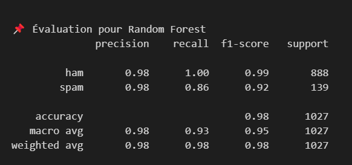
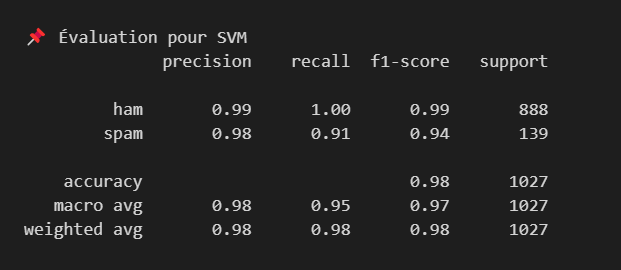
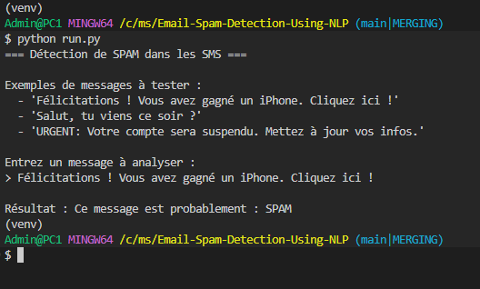

# 📩 Détection de SPAM dans les SMS

<!-- IMAGE D'EN-TÊTE -->
<p align="center">
  
</p>

---

## 📌 Présentation du projet

Ce projet est un système de **détection de spams dans les SMS**, basé sur les techniques de **traitement du langage naturel (NLP)** et le **Machine Learning**.  
Il utilise plusieurs modèles de classification, dont **Naive Bayes**, **SVM** et **Random Forest**, pour déterminer si un message est **normal** ou **indésirable (spam)**.

---

## 🧰 Prérequis et Installation

### Dépendances nécessaires
- [Python 3.x](https://www.python.org/downloads/)
- pandas
- numpy
- scikit-learn
- nltk
- matplotlib
- seaborn
- wordcloud
- gradio

### Installation

1. **Cloner le dépôt**
```bash
git clone https://github.com/codeangel223/SMS-Detection-SPAM.git
cd SMS-Detection-SPAM
```

2. **Créer et activer l'environnement virtuel**

**Sur Windows :**
```bash
python -m venv venv
venv\Scripts\activate
```

**Sur macOS/Linux :**
```bash
python3 -m venv venv
source venv/bin/activate
```

3. **Installer les dépendances**
```bash
pip install -r requirements.txt
```

---

## 📂 Dataset et Données

Le jeu de données contient environ **5 572 SMS**, chacun étiqueté comme suit :

- `spam` : message indésirable
- `ham` : message normal (non-spam)

**Source :** [French Spam SMS Dataset](https://www.kaggle.com/datasets/rajnathpatel/multilingual-spam-data?utm_source=chatgpt.com)

---

## 🔬 Méthodologie

### 🔹 1. Préparation des données
1. **Chargement du dataset**
2. **Nettoyage du texte** (suppression des stopwords, ponctuations, doublons)
3. **Analyse exploratoire des données (EDA)**
4. **Vectorisation des messages** via TF-IDF
5. **Découpage** des données en ensembles d'entraînement et de test

### 🔹 2. Modèles implémentés
Trois modèles de machine learning ont été entraînés et comparés :
- **Naive Bayes**
- **SVM (Support Vector Machine)**
- **Random Forest**

### 🔹 3. Évaluation des modèles
Les modèles ont été évalués selon les métriques suivantes :
- Accuracy (Exactitude)
- Precision (Précision)
- Recall (Rappel)
- F1-score

---

## 📊 Résultats et Analyse

### Comparaison des performances

| Modèle                | Accuracy | Precision | Recall | F1-score |
| --------------------- | -------- | --------- | ------ | -------- |
| Naive Bayes           | 0.97     | 0.95      | 0.93   | 0.94     |
| SVM                   | 0.98     | 0.97      | 0.94   | 0.955    |
| Random Forest         | 0.97     | 0.96      | 0.92   | 0.94     |

### Analyse critique des résultats

✅ **Modèle sélectionné** : **SVM (Support Vector Machine)**

**Justification :** Le modèle SVM présente le meilleur compromis entre précision, rappel et F1-score avec une accuracy de 98%, ce qui en fait le choix optimal pour cette tâche de classification.

#### Performances détaillées par modèle

**Naive Bayes**
<p align="center">
  
</p>

**Random Forest**
<p align="center">
  
</p>

**SVM (Support Vector Machine)**
<p align="center">
  
</p>

---

## 💻 Code Python Documenté

Le code source est organisé en plusieurs modules :

- `app.ipynb` : 
  - Nettoyage, 
  - préparation des données, 
  - Entraînement des modèles et 
  - Évaluation et comparaison des modèles
- `run.py` : Interface en ligne de commande (CLI)
- `gradio_app.py` : Application web avec interface Gradio

### Utilisation de l'interface CLI

4. **Lancer l'application CLI**
```bash
python run.py
```

Saisissez un message lorsque demandé, et le programme indiquera s'il s'agit de **SPAM** ou de **NORMAL**.

<p align="center">
  
</p>

---

## 🌐 App Web

### Interface Gradio

L'application dispose également d'une **interface web interactive** développée avec **Gradio**, permettant une utilisation plus conviviale et accessible.

#### Fonctionnalités de l'interface web :
- ✅ **Interface utilisateur intuitive** avec zone de saisie de texte
- ✅ **Prédiction en temps réel** du statut du message (SPAM/NORMAL)
- ✅ **Affichage du score de confiance** du modèle
- ✅ **Historique des prédictions** récentes
- ✅ **Interface responsive** compatible mobile et desktop

#### Lancement de l'application web

```bash
python ui.py
```

L'application se lance automatiquement dans votre navigateur à l'adresse : `http://localhost:7860`

<p align="center">
  
</p>

#### Avantages de l'interface web :
- **Accessibilité** : Pas besoin de connaissances techniques
- **Partage facile** : Possibilité de partager l'application via un lien public
- **Déploiement simple** : Compatible avec Hugging Face Spaces, Heroku, etc.
- **Expérience utilisateur optimisée** : Interface moderne et responsive

---

## 📋 Rapport Structuré

### 1. Exploration des données
- Analyse de la distribution des classes (spam/ham)
- Statistiques descriptives des messages
- Visualisation des mots les plus fréquents

### 2. Méthodologie appliquée
- Techniques de préprocessing du texte
- Stratégies de vectorisation (TF-IDF)
- Validation croisée et métriques d'évaluation

### 3. Résultats obtenus
- Performances comparatives des modèles
- Matrice de confusion
- Analyse des erreurs de classification

### 4. Analyse critique
- Forces et faiblesses de chaque approche
- Limitations du dataset
- Perspectives d'amélioration

---

## 🔄 Fonctionnalités Implémentées

- ✅ Nettoyage et prétraitement des données (stopwords, ponctuation, doublons)
- ✅ Analyse exploratoire des données (EDA)
- ✅ Vectorisation des textes avec **TF-IDF**
- ✅ Entraînement de plusieurs modèles de machine learning
- ✅ Sélection automatique du **modèle le plus performant**
- ✅ **Interface en ligne de commande (CLI)** pour la prédiction de nouveaux SMS
- ✅ **Application web interactive** avec Gradio
- ✅ **Déploiement facile** sur différentes plateformes

---

## 📚 Références

- [Scikit-learn Documentation](https://scikit-learn.org/stable/tutorial/text_analytics/working_with_text_data.html)
- [French Spam SMS Dataset](https://www.kaggle.com/datasets/rajnathpatel/multilingual-spam-data?utm_source=chatgpt.com)
- Documentation NLTK pour le traitement du langage naturel
- [Gradio Documentation](https://gradio.app/docs/)

---

## 📬 Contact

**Moussa Mallé**

- GitHub : [@codeangel223](https://github.com/codeangel223)
- E-mail : [codeangel223@gmail.com](mailto:codeangel223@gmail.com)
- E-mail Perso: [mallemoussa091@gmail.com](mailto:mallemoussa091@gmail.com)

---

> 🧠 Projet éducatif basé sur le NLP, le Machine Learning et la mise en pratique de la détection automatisée de messages indésirables.